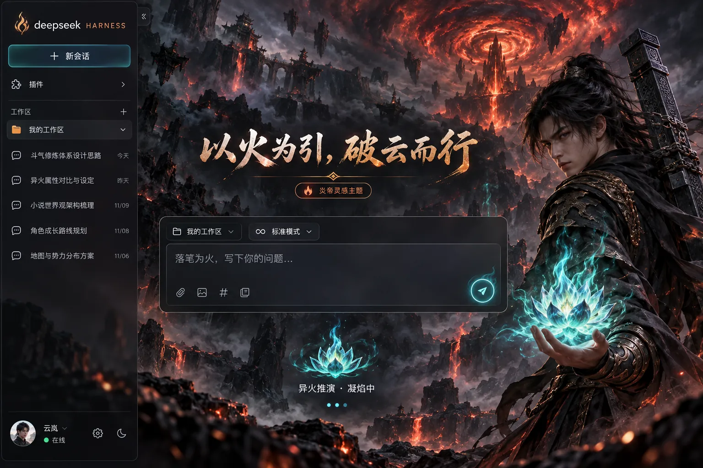

# 斗破苍穹灵感 · 炎帝意象主题

DeepSeek Harness Web 的独立主题插件。黑袍、重尺、青色火莲与赤色火山构成异火氛围，保留 DSH 的工作区、会话、输入和模型功能。



> 样图展示视觉方向。插件使用单独的原创背景和 DSH 主题 token，不把整张截图盖在真实 UI 上。人物为原创生成的灵感形象，并非萧炎动画原画或官方素材。本项目为非官方同人设计，与《斗破苍穹》作品方及 DeepSeek 无关联。

## 运行中的状态

回复进行时视觉提示为「异火推演 · 凝焰中」，计时后显示「异火推演 · 已炼 12 秒」。青色火纹轻轻脉动，橙青流光沿底边流动。系统开启“减少动态效果”后停止动画。完成、停止和失败提示保持原文；屏幕阅读器继续使用 DSH 原始状态播报。

## 安装与切换

在 DSH 桌面应用「插件 → 添加插件」中粘贴 `https://github.com/Xuanyi-king/dsh-theme-gallery` 安装统一主题库，然后到「设置 → 主题」选择「炎帝意象」。也可用 Web profile 一条命令安装：

```bash
dsh plugin --profile web add https://github.com/Xuanyi-king/dsh-theme-gallery
```

在「设置 → 主题」中可随时切换其他主题或选择「跟随 DSH」恢复默认。完整说明见[仓库首页](../../README.md)。

## 开发

```bash
npm run build
npm test
npm pack --dry-run
```

`assets/flame-scene.webp` 在构建时内嵌到 `lib/client.js`，运行时无需下载素材。代码使用 MIT 许可。若 DSH 主区域不采用 `main` 或 `[role="main"]`，配色仍生效，但场景背景可能不显示。样图的首页标题与输入占位文字是概念文案，插件只改变运行中的回复状态提示。
