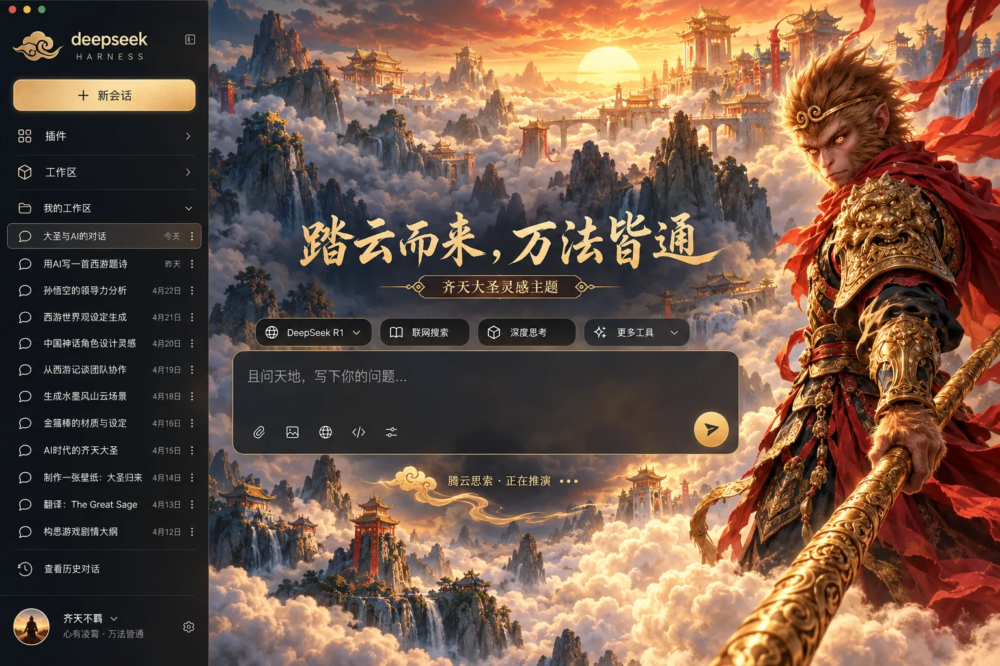

# 齐天大圣 · DSH 主题

DeepSeek Harness Web 的独立主题插件。金箍棒、火眼金睛、红披风与云上天宫组成赤金与藏蓝色的神话界面。工作区、会话、输入和模型功能沿用 DSH。



> 样图展示视觉方向。实际插件使用单独的原创云宫背景和 DSH 主题 token，不会将整张样图盖在界面上。角色为原创生成的传统神话灵感形象，未采用影视或游戏版本的官方图像；本项目与 DeepSeek 无关联。

## 运行中的状态

回复进行时，视觉提示为「腾云思索 · 正在推演」，计时后为「腾云思索 · 已行 12 秒」。金色云纹缓缓上浮，流光沿提示底边掠过。系统开启“减少动态效果”后停止动画。完成、停止和失败状态保持原文，屏幕阅读器继续使用 DSH 原始播报。

## 安装

按 DSH `v0.1.7-rc.1` Web 客户端的 `ctx.theme` 接口制作。先卸载其他正在自动启用的主题：

```bash
git clone https://github.com/xuanyi-niubi/dsh-shanhe-theme.git
cd dsh-shanhe-theme/themes/great-sage
npm run pack:local
dsh plugin --profile web add ./dsh-great-sage-theme-0.1.0.tgz
```

重启 `dsh web` 并刷新浏览器。卸载：

```bash
dsh plugin --profile web remove dsh-great-sage-theme
```

## 开发

```bash
npm run build
npm test
npm pack --dry-run
```

`assets/cloud-palace.webp` 在构建时内嵌于 `lib/client.js`，运行时不下载素材。代码为 MIT 许可。若 DSH 主区域不使用 `main` 或 `[role="main"]`，主题配色仍生效，但场景背景可能无法显示。样图中的首页标题与输入提示为概念文案，插件只改运行中的回复状态视觉。
