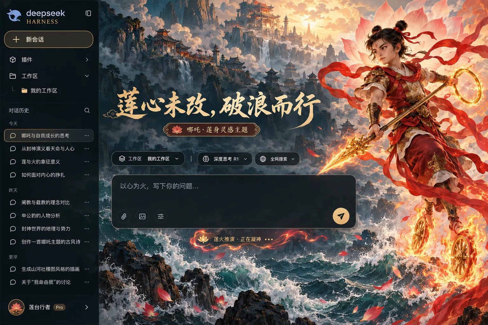

# 哪吒 · 莲身破浪 DSH 主题

为 DeepSeek Harness Web 制作的独立主题插件。参考中国神话小说《封神演义》的莲身与法宝意象：双髻、混天绫、乾坤圈、火尖枪、风火轮。夜海藏青、朱砂与莲火暖金构成主题配色，保留 DSH 原有工作区与对话功能。



> 样图展示视觉方向。插件使用单独的原创背景和 DSH 主题 token，不将样图覆盖到真实界面。人物为原创生成的古典小说灵感形象，未使用现代电影或动画版角色素材。本项目与 DeepSeek 及相关影视作品方无关联。

## 运行中的状态

回复时视觉提示为「莲火推演 · 正在凝神」，计时后为「莲火推演 · 已历 12 秒」。莲花标记缓缓明灭，朱砂与金色流光沿底边移动。系统开启“减少动态效果”后动画停止。完成、停止和失败状态保持原文，屏幕阅读器继续使用 DSH 的原始播报。

## 安装与切换

在 DSH 桌面应用「插件 → 添加插件」中粘贴 `@xuanyi-king/dsh-theme-gallery` 安装统一主题库，然后到「设置 → 主题」选择「哪吒 · 莲身破浪」。也可用 Web profile 一条命令安装：

```bash
dsh plugin --profile web add @xuanyi-king/dsh-theme-gallery
```

在「设置 → 主题」中可随时切换其他主题或选择「跟随 DSH」恢复默认。完整说明见[仓库首页](../../README.md)。

## 开发

```bash
npm run build
npm test
npm pack --dry-run
```

`assets/lotus-sea.webp` 构建时嵌入 `lib/client.js`，运行时无需下载素材。代码使用 MIT 许可。若实际 DSH 主区域没有 `main` 或 `[role="main"]`，配色仍生效，但背景可能不显示。样图中的首页标题和输入占位文案仅供展示，插件只改写回复运行状态的视觉提示。
