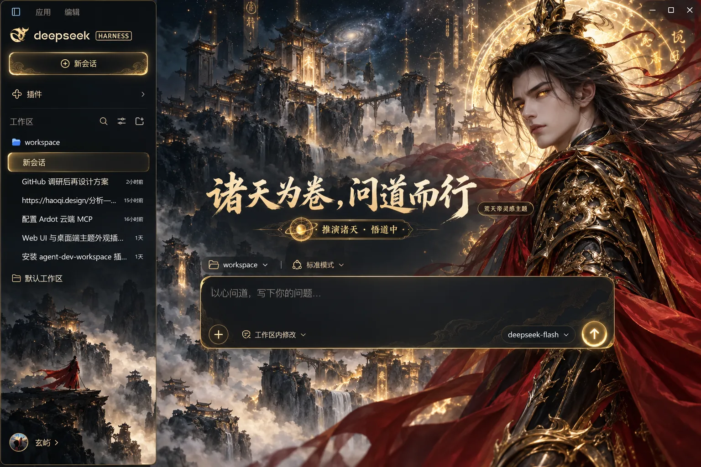

# 完美世界灵感 · 荒天帝意象主题

独立的 DeepSeek Harness Web 主题插件。长发帝者、黑金战甲、赤色披风、诸天宫阙与金色道纹构成暗色玄幻氛围。保留 DSH 工作区、对话、输入及模型功能。



> 样图展示设计方向。插件使用单独的原创人物背景及 DSH 主题 token；不会把截图盖在真实界面上。人物是独立生成的灵感形象，并非动画原画或官方角色素材。本项目为非官方同人设计，与《完美世界》作品方及 DeepSeek 无关联。

## 运行状态

回复进行时，视觉提示为「推演诸天 · 悟道中」，计时后显示「推演诸天 · 已历 12 秒」；金色道纹轻微旋转，赤金流光沿底边流动。系统开启减少动态效果后动画停止。完成与失败状态保留原文，屏幕阅读器使用 DSH 原始播报。

## 安装与切换

在 DSH 桌面应用「插件 → 添加插件」中粘贴 `@xuanyi-king/dsh-theme-gallery` 安装统一主题库，然后到「设置 → 主题」选择「荒天帝意象」。也可用 Web profile 一条命令安装：

```bash
dsh plugin --profile web add @xuanyi-king/dsh-theme-gallery
```

在「设置 → 主题」中可随时切换其他主题或选择「跟随 DSH」恢复默认。完整说明见[仓库首页](../../README.md)。

## 开发

```bash
npm run build
npm test
npm pack --dry-run
```

`assets/emperor-scene.webp` 在构建时内嵌到 `lib/client.js`，运行无需在线下载素材。`cordis.patch.yml` 供插件命令挂载。图像为原创生成素材，代码采用 MIT 许可。若实际 DSH 主区域没有 `main` 或 `[role="main"]`，配色仍生效，但背景可能无法显示。样图里的首页标题和输入提示是概念文案，插件只改变回复中的状态提示。
