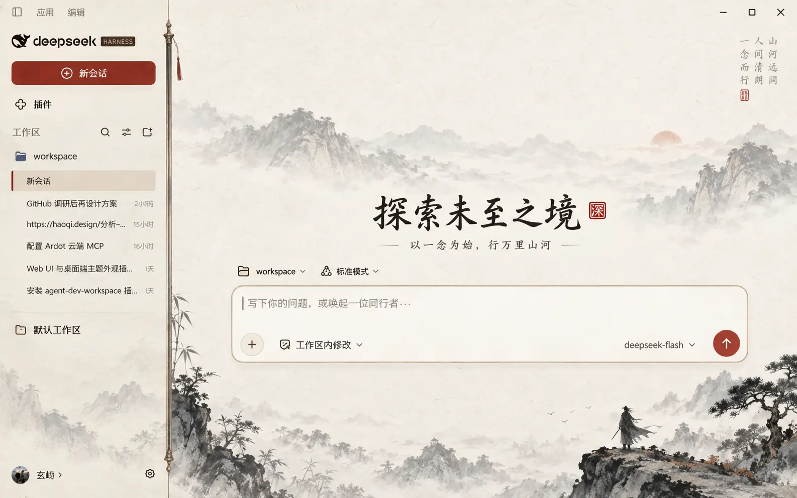

# 山河剑意 · DSH 主题

为 DeepSeek Harness Web 设计的水墨主题插件。宣纸暖底、浅墨远山、朱砂交互色；只修改界面外观，不接触会话、模型或文件内容。灵感来自古风山水与江湖意境，不包含《剑来》的角色、文字或官方美术素材。



> 图片是设计概念图；实际主题保留 DSH 原有界面文字与功能，山水细节由插件内嵌 WebP 场景呈现。

### 运行中的状态

回复前的进程提示保留 DSH 原生文字，避免装饰遮住运行信息。

这层显示只作用于 DSH 0.1.7 的运行中 Turn 按钮；已完成、停止和失败状态保留原文字，供屏幕阅读器读取的状态播报也保持原样。若 DSH 后续修改该按钮的 DOM 结构，装饰可能不再生效，但原有状态仍可正常阅读。

## 安装与切换

在 DSH 桌面应用「插件 → 添加插件」中粘贴 `@xuanyi-king/dsh-theme-gallery` 安装统一主题库，然后到「设置 → 主题」选择「山河剑意」。也可用 Web profile 一条命令安装：

```bash
dsh plugin --profile web add @xuanyi-king/dsh-theme-gallery
```

在「设置 → 主题」中可随时切换其他主题或选择「跟随 DSH」恢复默认。完整说明见[仓库首页](../../README.md)。

## 开发

```bash
npm run build
npm test
npm pack --dry-run
```

`src/client.mjs` 注册主题 token；`assets/theme.css` 和 `assets/ink-landscape.webp` 随构建内嵌于 `lib/client.js`，无需联网加载图像或字体。`cordis.patch.yml` 让 `dsh plugin add` 自动挂载插件。npm 包同时包含预构建的 `lib/`，下载仓库源码后可直接本地打包。

首页和对话区使用水墨场景，并给 DSH 原有侧栏与输入卡片添加匹配的材质和边线。插件不生成概念图中的装饰性文案或新按钮。

## 许可

MIT。项目与 DeepSeek 官方及《剑来》作品方无关联。
