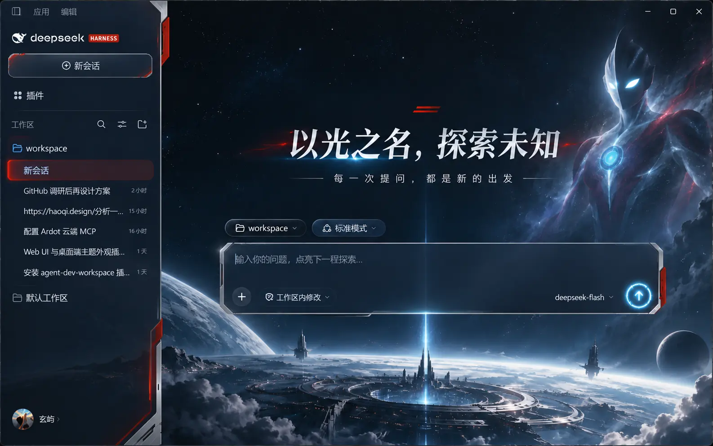

# 奥特曼灵感 · DSH 光之巨人主题

独立的 DeepSeek Harness Web 客户端主题插件。红银色点缀、深蓝宇宙、蓝色能量核心，保留 DSH 原有工作区、会话、输入与模型功能。



> 样图用于展示视觉方向。插件用单独的原创宇宙背景和 DSH 的主题 token 实现外观；不把整张界面截图盖在真实 UI 上。巨人、双眼、能量核心均为原创视觉，未使用官方角色素材、商标或标志。本项目是非官方粉丝创作，与 DeepSeek 或奥特曼作品方无关联。

## 运行中的状态

DSH 正在回复时，运行提示会显示「光能解析 · 聚焦中」；计时后显示「光能解析 · 已持续 12 秒」。左侧蓝色能量核心缓缓脉动，进度线流动。系统开启“减少动态效果”后，动画停止。完成、停止和失败提示保持原文，屏幕阅读器的状态播报也保持原样。

## 安装与切换

在 DSH 桌面应用「插件 → 添加插件」中粘贴 `https://github.com/Xuanyi-king/dsh-theme-gallery` 安装统一主题库，然后到「设置 → 主题」选择「光之巨人」。也可用 Web profile 一条命令安装：

```bash
dsh plugin --profile web add https://github.com/Xuanyi-king/dsh-theme-gallery
```

在「设置 → 主题」中可随时切换其他主题或选择「跟随 DSH」恢复默认。完整说明见[仓库首页](../../README.md)。

## 开发

```bash
npm run build
npm test
npm pack --dry-run
```

`src/client.mjs` 注册深色语义 token 并仅装饰运行中的进程提示。`assets/theme.css` 与 `assets/cosmic-scene.webp` 在构建时内嵌至 `lib/client.js`，运行时无需下载背景图。`cordis.patch.yml` 供 `dsh plugin add` 自动挂载。图像资源是原创生成的视觉资产；代码使用 MIT 许可。

实际 Web 界面的主区域若不使用 `main` 或 `[role="main"]`，主题配色仍生效，但宇宙背景可能不会显示。样图中的首页标题和输入提示是概念文案，目前插件不会改写 DSH 的这些功能文字。
