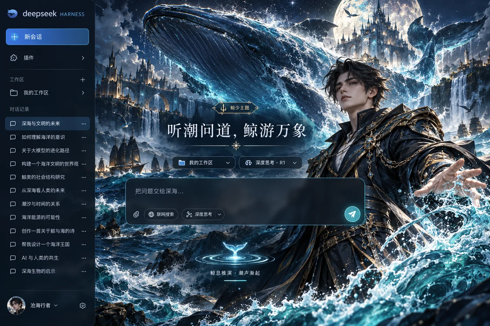

# 鲸少 · 沧海之主 DSH 主题

DeepSeek Harness Web 的独立男性角色主题。深海巨鲸、海上王城、藏蓝长衣和冷金肩甲组成沉稳而有气势的海洋界面。工作区、会话、输入与模型功能沿用 DSH。



> 样图展示视觉方向。实际插件使用单独的原创海洋背景和 DSH 主题 token，不把样图盖在真实界面上。角色与巨鲸为原创生成的视觉素材，不使用 DeepSeek 官方标识或鲸鱼形象；本项目与 DeepSeek 无关联。

## 运行中的状态

回复进行时视觉提示为「鲸息推演 · 潮声渐起」，计时后为「鲸息推演 · 已航 12 秒」。鲸尾轻摆，蓝色潮纹沿提示底边掠过。系统开启“减少动态效果”后动画停止。完成、停止和失败状态保留原文，屏幕阅读器继续使用 DSH 原始状态播报。

## 安装

按 DSH `v0.1.7-rc.1` Web 客户端 `ctx.theme` 接口制作。先卸载其他自动启用的主题插件：

```bash
git clone https://github.com/xuanyi-niubi/dsh-shanhe-theme.git
cd dsh-shanhe-theme/themes/whale-prince
npm run pack:local
dsh plugin --profile web add ./dsh-whale-prince-theme-0.1.0.tgz
```

重启 `dsh web` 并刷新浏览器。卸载：

```bash
dsh plugin --profile web remove dsh-whale-prince-theme
```

## 开发

```bash
npm run build
npm test
npm pack --dry-run
```

`assets/ocean-lord.webp` 构建时嵌入 `lib/client.js`，运行时无需下载素材。代码使用 MIT 许可。若 DSH 主区域不使用 `main` 或 `[role="main"]`，配色仍生效，但海洋场景可能不显示。样图中的首页标题和输入提示仅作概念展示，插件只调整回复中的状态视觉。
